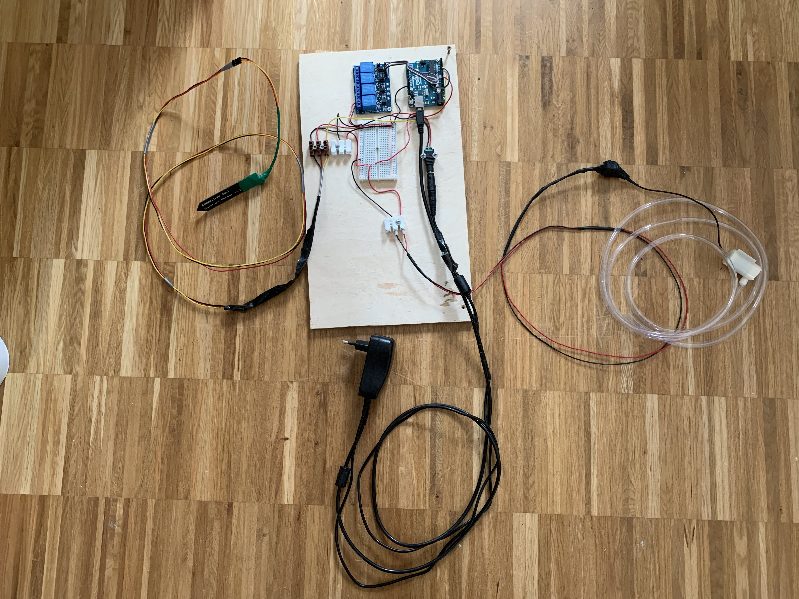

# Arduino Plant Watering System

This system tries to automatically watering flowerpots only when it’s necessary.

-----

## Requirements

#### Hardware

- Moisture Sensor 1.2
- Arduino Uno
- Relays (for controlling pumps)
- Water Pump

#### Arduino Libraries

Install these arduino libraries via your editor interface:

- LiquidCrystal I2C